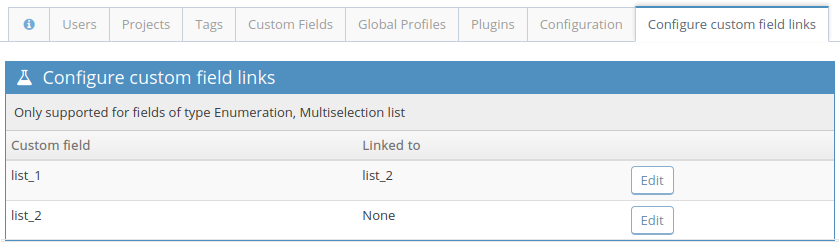
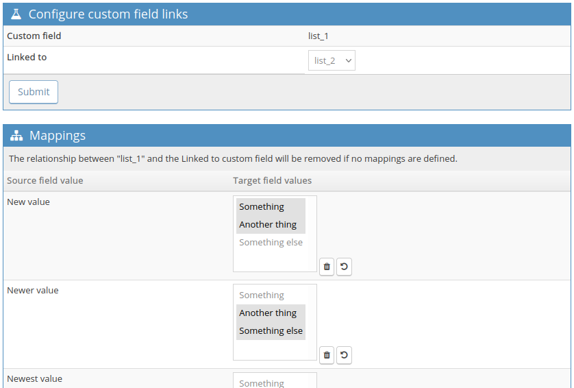
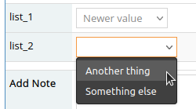

# Linked Custom Fields plugin for MantisBT

Copyright (c) 2011 Robert Munteanu - robert@lmn.ro  
Copyright (c) 2018, 2022 Damien Regad

Released under the [GNU General Public License version 2](http://opensource.org/licenses/GPL-2.0)

See the [Changelog](https://github.com/mantisbt-plugins/LinkedCustomFields/blob/master/CHANGELOG.md).

## Description

The LinkedCustomFields plugin allows you to link values between two custom
fields, creating linked drop-downs.

## Requirements

The plugin requires [MantisBT](https://mantisbt.org/) version 2.3 or higher.

If you need compatibility with older releases of MantisBT, please use [legacy
versions](https://github.com/mantisbt-plugins/LinkedCustomFields/releases) of the plugin, 
as per table below:

| MantisBT version |                                   Plugin version                                    |
|:----------------:|:-----------------------------------------------------------------------------------:|
|       1.3        |                                    Not supported                                    |
|       1.2        | [1.0.1](https://github.com/mantisbt-plugins/LinkedCustomFields/releases/tag/v1.0.1) |

## Installation

1. Download or clone a copy of the 
   [plugin's code](https://github.com/mantisbt-plugins/LinkedCustomFields).
2. Copy the plugin (the `LinkedCustomFields/` directory) into your Mantis
   installation's `plugins/` directory, or create a link to it.
3. While logged into your Mantis installation as an administrator, go to
   *Manage -> Manage Plugins*.
4. In the *Available Plugins* list, you'll find the *LinkedCustomFields* plugin;
   click the **Install** link.

## Usage

### Configuring Linked Custom Fields

The plugin's configuration page is accessed from the _Manage_ menu, where a new 
item named _Configure custom field links_ is present.

Access to this page is restricted to users having the *manage_custom_fields_threshold*
(standard MantisBT config option, defaulting to ADMINISTRATOR).

**Note:** the plugin only supports ENUMERATION and MULTI_SELECT custom field types.

1. Pick one of the fields in list, then click _Edit_.
2. In the _Configure custom field links_ section, 
   select the target field in the _Linked to_ list.
3. In the _Mapping_ section, each value from the source field can be associated
   to any number of values from the target field.  
   **Note:** Selecting no values means that they are all valid.

### Using Linked Custom Fields

When editing an issue in a project where the linked custom fields are available,
once a value from the source custom field has been selected, only the configured
corresponding values will be available from the target custom field.

## Support

The following support channels are available if you wish to file a
[bug report](https://github.com/mantisbt-plugins/LinkedCustomFields/issues/new),
or have questions related to use and installation:

  - Plugin's [GitHub issue tracker](https://github.com/mantisbt-plugins/LinkedCustomFields/issues)
  - MantisBT [Gitter chat room](https://gitter.im/mantisbt/mantisbt)

The [legacy issue tracker](https://mantisbt.org/bugs/search.php?project_id=16&sticky_issues=1&sortby=last_updated&dir=DESC)
hosted in the _Plugin - LinkedCustomFields_ project on Mantis Bug Tracker
remains available in read-only mode, for historical purposes.
